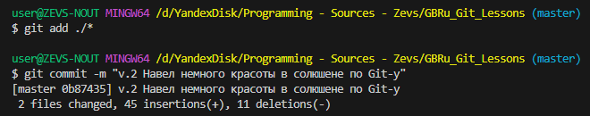

> *Человек может быть гением или обладать всеми необходимыми навыками, но если он не верит в себя, он не будет выкладываться по полной. —  Марк Цукерберг*

# Справочник по основным (базовым) командам GIT

***Примечание:*** *В этом файле я буду сохранять для себя некоторые полезные команды GIT-а.*


## Сразу после установки Git-а

можно проверить правильность его установки *(а заодно и узнать версию)* вот такой командой. Можно, в принципе, любой командой. Это просто, как пример.

```sh
git --version
```

## Начало работы с GIT-ом.

Прежде всего необходимо перейти в папку за которой мы хотим следить и контролировать ее с помощью Git-а.
Теперь в этой папке необходимо создать Git-репозиторий. Это делается вот такой командой.

```sh
git init
```

## Добавление файла(ов) в репозиторий (индексация файла)

```sh
git add <filename>
```

***Заметочка #1:*** *Если мы не хотим добавлять какие-то файлы в репозиторий, но при этом они у нас лежат в нашей рабочей папке, то Git все равно будет про них напоминать. А вот, чтобы он про них не напоминал, нужно создать файл с именем .gitignore и в нем прописать имена файлов, которые должны быть исключены из контроля Git-ом.*

Вот пример такого файла:

***Заметочка #2:*** *Можно добавлять сразу несколько файлов. Но надо хорошо изучить командную строку. Добавить все файлы в текущей папке можно, например, так, как на скриншоте ниже.*




***Примечание:*** *На этом шаге существует еще возможность легко откатиться назад, т.к. изменения не подтверждены (не закоммитчены). См. следующий пункт.*

## Откат еще не закомитченных изменений до последнего коммита

```sh
git restore <filename>
```

## Подтверждение внесенных изменений и подтверждение добавления измененных файла(ов) в репозиторий (commit)

```sh
git commit -m "Комментарий к внесенным правкам"
```

## Работа с логами репозитория:

* ### Просмотр всего лога

```sh
git log
```

* ### Просмотр short-списка лога

```sh
git log --oneline
```

## Перемещение по разным версиям (коммитам)

### Вернуться к основной (master) версии

```sh
git checkout master
```

### Переключиться на любую другую версию

```sh
git checkout <version_hash_select>
```

## Получение статуса (состояния) git

```sh
git status
```

## Посмотреть разницу между последним коммитом и текущим состоянием.

```sh
git diff
```

## РАБОТА С ВЕТКАМИ

<!-- Просмотр веток-->
git branch

<!-- Создание новой ветки -->
git branch <new_branch_name>

<!-- Переход на другую ветку -->
git checkout <branch_name>

<!-- А теперь, предположим, что мы доделали какую-то ветку, кроме master до конца и хотим применить эту ветку к ветке master. -->
<!-- Для этого нужно завершить работу с переносимой суб-веткой (все проверить и закоммитить) и перейти в ветку master и выполнить команду -->
git merge <adding_branch_name>

<!-- Теперь, если только что слитая (добавленная) ветка больше не нужна, то ее можно удалить из репозитория. -->
git branch -d <deleted_branch_name>

<!-- А вот таким образом можно визуализировать весь наш проект (репозиторий) со всеми ветками и МОЙ МОЗГ ВЗОРВАН :) субветками, чтобы знать, что у нас есть и откуда что растет. -->
git log --graph


### ВАЖНО ! *Не боимся пользоваться поисковиками в сети - много полезной информации можно найти по ньюансам команд Git-а.*

#### Нашел несколько полезных ссылок. Делюсь:
1. [Git для новичков (часть 1)](https://habr.com/ru/articles/541258/ "Git для новичков (часть 1) на Хабре");
2. [Git для новичков (часть 2)](https://habr.com/ru/articles/542616/ "Git для новичков (часть 2) на Хабре");
3. А остальное для самостоятельного поиска :)
